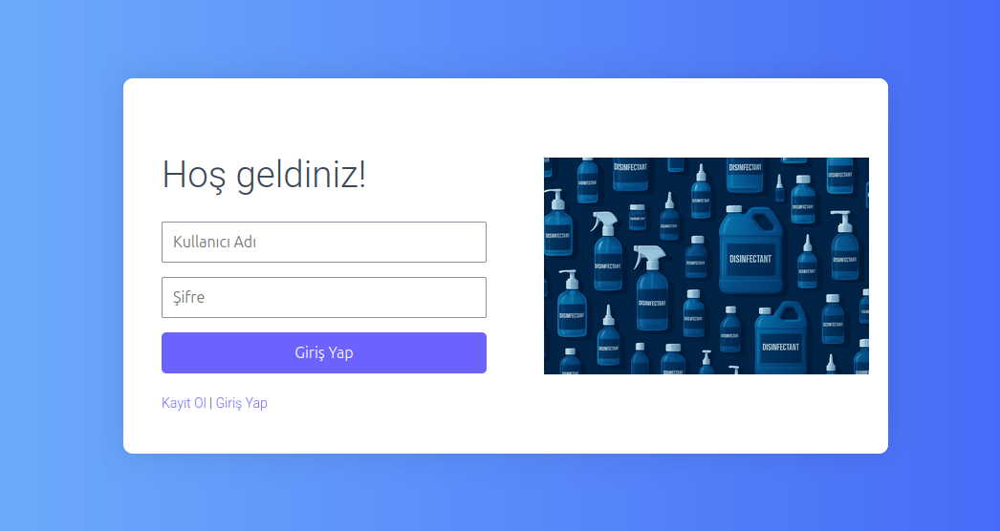

#  Stok Kontrol Sistemi

Bu proje, dezenfektan ve malzeme stoklarını yönetmek, faturaları, müşterileri, tedarikçileri ve kasa hareketlerini kontrol etmek için geliştirilmiş bir **Stok Takip Sistemi**dir. Hem **web** (React + Django) hem de **mobil** (React Native) arayüz desteği bulunmaktadır.

---

##  Özellikler

- ✅ Stok yönetimi (dezenfektan ve malzeme)
- ✅ Fatura yönetimi (oluşturma, güncelleme, silme)
- ✅ Müşteri ve tedarikçi yönetimi
- ✅ Kasa giriş-çıkış işlemleri
- ✅ Görev takibi ve hatırlatma sistemi
- ✅ Minimum stok uyarı sistemi (bildirimli)
- ✅ React Native mobil uygulama desteği
- ✅ Giriş/kayıt ve profil güncelleme işlemleri

---

##  Kullanılan Teknolojiler

### Backend:
- Django
- Django Rest Framework (DRF)

### Frontend (Web):
- React
- Tailwind CSS
- Recharts (grafikler için)

### Mobil:
- React Native
- React Navigation
- Axios

### Diğer:
- SQLite / PostgreSQL
- Git & GitHub

---
## 📷 Ekran Görüntüleri

### Login Sayfası

### Dashboard

